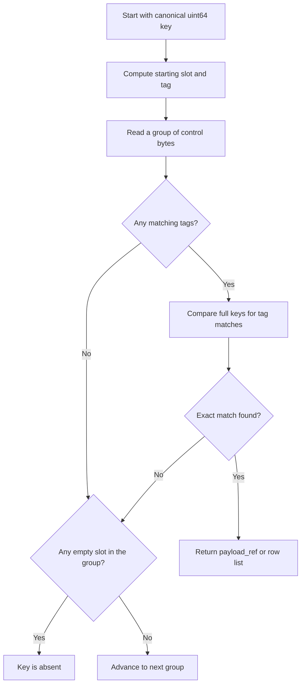
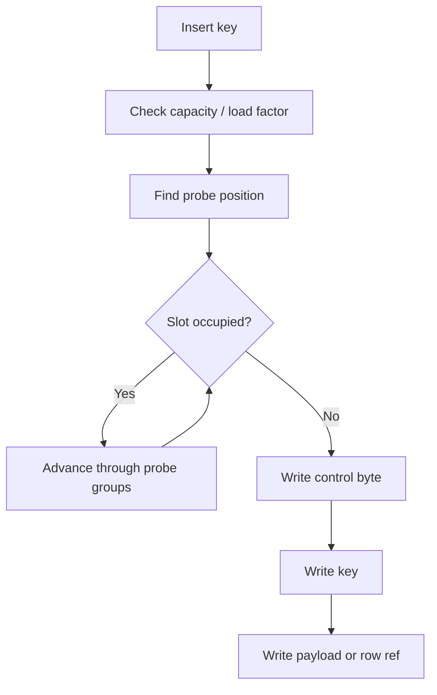
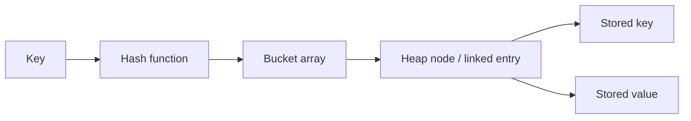
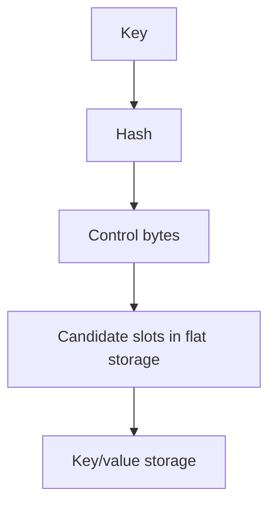
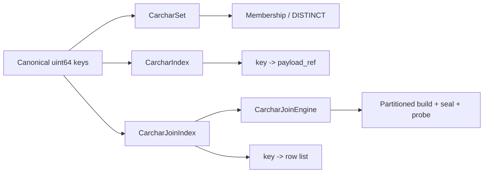

# Carchar Hash Table Explained
## A Human-Readable Guide to How It Works, Why It Is Faster Than a General-Purpose Map, and How We Can Use It to Improve Performance

## What This Document Is

Carchar is Opteryx's specialized hash-table family for join and grouped-aggregation workloads.

This document explains:

1. how Carchar stores and finds keys
2. how it differs from `std::unordered_map`
3. how it differs from Abseil's `flat_hash_map` / Swiss-table style containers
4. how we can use its design to find and unlock performance wins

The goal is not to describe a perfect general-purpose map.
The goal is to explain a fast, disposable execution structure that is shaped around Opteryx's workloads.

---

## The Short Version

Carchar works well because it removes a lot of the things a general-purpose hash map must support but Opteryx usually does not need:

1. it expects canonical `uint64` keys
2. it does not do source-value hashing inside the table
3. it uses open addressing and contiguous arrays instead of per-entry heap objects
4. it stores tiny control bytes so probes can skip most full key comparisons
5. it is batch-oriented, not random-access oriented
6. it can be partitioned and then sealed for faster probing
7. it exposes stats so we can tune it using real workload evidence

In plain language:

`std::unordered_map` is a flexible toolbox.
Abseil's Swiss table is a very fast general-purpose box.
Carchar is a custom power tool built for a narrower job, so it can be faster for that job.

---

## The Core Idea

Carchar keeps the hash table in a few flat arrays:

1. a `control` array with tiny metadata bytes
2. a `hashes` array with the canonical `uint64` keys
3. a payload array, when the table needs to point at join rows or aggregate state

The key trick is that the control bytes let the table skip most full key comparisons.

Instead of checking every stored key one by one, Carchar first looks at a small group of control bytes and asks:

1. which slots might match this key tag?
2. which slot is empty, so we can stop early?

That makes probing much cheaper than scanning full keys repeatedly.

---

## What The Table Actually Stores

### For a set

`CarcharSet` stores:

1. the key itself
2. a control tag derived from the key

It is used for membership checks and DISTINCT-style workloads.

### For an index

`CarcharIndex` stores:

1. the key itself
2. a `payload_ref` value

The payload reference is not the data itself. It is an index or handle to the real payload.

### For joins

`CarcharJoinIndex` stores:

1. the key
2. a payload reference
3. a row list behind that payload reference

That row list is optimized for the common case where a key matches one row or a few rows:

1. the first row is stored inline
2. the second row is stored inline
3. extra rows spill into a small vector

### For partitioned joins

`CarcharJoinEngine` wraps multiple `CarcharJoinIndex` instances.

It can:

1. partition incoming keys
2. build each partition independently
3. seal the partitions into a read-optimized form
4. probe them in batch

---

## How A Lookup Works

The lookup path is deliberately simple:

1. normalize the key
2. compute a small tag from the key
3. find the starting slot from the key bits
4. scan a group of control bytes
5. only compare full keys for slots whose tag matches
6. stop as soon as an empty slot proves the key is not present

This is why the control array matters.

Without control bytes, every probe would need to compare many full keys.
With control bytes, most slots are rejected cheaply before touching the full key array.

### Lookup flow

---

## How Insertion Works

Insertion follows the same pattern, but with a write step at the end:

1. check whether the table needs to grow
2. compute the starting slot and key tag
3. probe until an empty slot is found
4. write the control byte, key, and payload

Because Carchar uses open addressing, the data stays contiguous.
That is a major reason it stays cache-friendly.

### Insertion flow

---

## Why The Control Bytes Matter

The control byte is a tiny metadata value for each slot.

In this implementation:

1. `0x80` marks an empty slot
2. the other bits carry a short key tag
3. the tag is derived from the high bits of the canonical key

That gives the probe loop two fast tests:

1. "could this slot match?"
2. "can I stop searching yet?"

That is the main source of speed.

It reduces:

1. full key comparisons
2. branchy per-entry logic
3. pointer chasing

---

## How This Compares To `std::unordered_map`

`std::unordered_map` is the standard library's general-purpose hash map.

It is designed for correctness, flexibility, and a broad API surface.

### Typical `std::unordered_map` shape

### Why it is usually slower for Carchar-style workloads

1. it often uses node-based storage or bucket chains, which means more pointer chasing
2. entries are usually separate objects, which hurts locality
3. the data layout is not built around SIMD-friendly control-byte scans
4. it has to support a very broad set of semantics, including erase, iterator stability expectations, and general value behavior
5. it is not usually designed around batched build/probe execution

### Where it is still useful

`std::unordered_map` is still a good fit when:

1. the workload is small
2. the code path is not hot
3. API simplicity matters more than raw speed
4. the table lives outside a tight operator kernel

For Opteryx's join and aggregate inner loops, though, it is usually too generic.

---

## How This Compares To Abseil `flat_hash_map`

Abseil's `flat_hash_map` is much closer to Carchar than `std::unordered_map` is.

It uses:

1. open addressing
2. contiguous storage
3. control-byte-style metadata
4. SIMD-friendly probing

That makes it a strong general-purpose container.

### Typical Abseil Swiss-table shape

### Why Carchar can still be faster

Carchar is not trying to beat Abseil by being a better all-purpose container.
It wins by being more specialized.

Key differences:

1. Carchar assumes canonical `uint64` keys
2. Carchar does not hash arbitrary source values inside the table
3. Carchar is organized around Opteryx operator stages, not a general container API
4. Carchar can separate set, index, join, and partitioned-join behavior into tailored layouts
5. Carchar can use batch grouping and sealing to improve locality further
6. Carchar can expose operator-focused stats and tuning knobs directly

### The practical takeaway

Abseil is an excellent baseline and often a very good choice.

Carchar becomes attractive when:

1. the key type is fixed and canonical
2. the access pattern is dominated by build/probe loops
3. the structure is short-lived
4. we can shape the layout around the exact operator we are running

---

## The Carchar Design In One Picture

---

## Why It Helps Performance

Carchar improves performance by attacking the usual hash-table bottlenecks one by one.

### 1. Less allocation overhead

Because the structure is built from flat arrays, it avoids lots of tiny heap objects.

That helps:

1. allocation cost
2. allocator contention
3. cache locality

### 2. Better cache locality

Contiguous arrays keep the hot working set small and predictable.

That helps when the same keys are probed many times in a batch.

### 3. Fewer full key comparisons

Control-byte filtering means the table often rejects most slots before reading the full key.

### 4. Better batch behavior

The code already assumes batch input in the join and set bulk operations.

That lets us:

1. reserve once
2. insert in bulk
3. group probes by locality
4. reuse temporary buffers

### 5. Specialized payload handling

Join rows are not stored like generic values.

Instead, Carchar stores compact references and keeps row lists in a format that favors the common case of small multiplicity.

### 6. Partition-aware execution

`CarcharJoinEngine` can split work by partition bits before probing.

That means each partition sees a smaller table and a tighter hot set.

---

## How We Can Use Carchar To Drive Performance Improvements

The value of Carchar is not just the implementation itself.
The bigger value is that it gives us a performance model we can reason about.

### 1. Tune around the real hot path

Use the structure where the workload matches it:

1. join build
2. join probe
3. grouped aggregation
4. DISTINCT / membership checks

If a code path is not hot, do not over-optimize it with Carchar.

### 2. Reserve early

The code exposes `reserve()` in the main table types.

That is important because it lets us avoid repeated rehashing and resizing during large builds.

Good time to reserve:

1. when cardinality is known from planning
2. when the batch size is known
3. when a partition size estimate is available

### 3. Keep load factor sensible

The table tracks load and probe counts.

That lets us find the balance between:

1. memory footprint
2. probe length
3. resize cost

If load factor is too high, probe chains get longer.
If load factor is too low, memory usage rises and cache density falls.

### 4. Use sealing where it actually helps

`CarcharJoinEngine` supports a build phase and a sealed read phase.

That matters because some workloads are faster when the final probe layout is more optimized than the mutable build layout.

If sealing does not help a workload, we should not force it.

### 5. Partition only when it pays off

Partitioning is not automatically free.

It helps when:

1. the table is large enough
2. the probe batches are large enough
3. locality gains outweigh partition overhead

It hurts when:

1. the partitions become too small
2. the extra grouping work dominates
3. the query is already tiny

### 6. Use stats to spot the real bottleneck

`CarcharStats` already tracks:

1. capacity
2. size
3. resize count
4. lookup count
5. insert count
6. total probes
7. max probe length
8. average probe lengths
9. estimated bytes

That makes it possible to answer questions like:

1. are we resizing too often?
2. are probes getting too long?
3. is a workload memory-heavy or probe-heavy?
4. are lookups or inserts the problem?

### 7. Compare against the right baseline

Use the benchmark harness to compare:

1. Abseil `flat_hash_map`
2. the compiled Carchar module

The existing benchmark script already measures:

1. build time
2. hit-probe time
3. locality sweeps across different row counts

That gives us a practical way to tell whether a change helped or just shifted cost around.

---

## Performance Stats We Already Have

We do not currently have a checked-in Carchar benchmark report in the repo, but the implementation already exposes the most useful internal counters.

### Table-level stats

`CarcharStats` reports:

1. `capacity`
2. `size`
3. `resize_count`
4. `lookup_count`
5. `insert_count`
6. `total_probes`
7. `max_probe_length`
8. `lookup_total_probes`
9. `insert_total_probes`
10. `max_lookup_probe_length`
11. `max_insert_probe_length`
12. `bytes_estimate`

From those, we can derive:

1. average probe length
2. average lookup probe length
3. average insert probe length
4. load factor
5. bytes per entry

### Why these stats matter

These counters tell us whether the table is healthy or fighting the workload.

1. High `resize_count` means we are under-reserving or sizing partitions badly.
2. High `max_lookup_probe_length` means the table is getting too full or the hash distribution is poor.
3. A large gap between average and max probe length means most lookups are fine, but a tail of bad cases may be hurting latency.
4. A high `bytes_estimate / size` ratio means we are paying too much memory for the current layout.
5. High insert probes but low lookup probes means build-side pressure is the problem.
6. High lookup probes but low insert probes means probe-side locality or load factor is the problem.

### What we should publish in benchmark output

The benchmark harness is already close to this, but the most useful published numbers would be:

1. build time
2. probe time
3. rows seen
4. capacity
5. size
6. bytes estimate
7. bytes per entry
8. average lookup probe length
9. max lookup probe length
10. resize count
11. load factor

That gives us both throughput and shape information.

### Best comparison axes

When we compare Carchar against Abseil or `std::unordered_map`, the most meaningful slices are:

1. cardinality
2. duplicate ratio
3. probe hit ratio
4. batch size
5. partition count
6. load factor
7. sealed vs mutable probing

Those dimensions will usually explain more than raw row count alone.

---

## Additional Ideas To Push Performance Further

There are a few likely next wins, ordered from low-risk to more invasive.

### 1. Separate build and probe tuning more aggressively

Right now build and probe share a lot of structure. We can probably improve by making the probe layout even more specialized.

Possible direction:

1. keep a more permissive mutable layout during build
2. generate a tighter sealed layout for probe-heavy workloads
3. choose the cheaper mode based on observed probe volume

### 2. Tune partitioning by workload shape

`CarcharJoinEngine` already partitions by upper hash bits.

We could improve this by making partition count depend on:

1. row count
2. expected duplication
3. cache size
4. probe batch size

The current default may be good enough for many cases, but a workload-aware heuristic could avoid over-partitioning small joins and under-partitioning large ones.

### 3. Improve row-list storage for join-heavy duplicates

The join index stores the first two rows inline and then spills to a vector.

That is good for small multiplicities, but it may still be expensive when a few keys fan out heavily.

Potential improvements:

1. small fixed-capacity inline arrays before spilling
2. chunked overflow storage to reduce vector growth churn
3. compact row-count encoding when duplication is high

### 4. Add batch-level probe grouping more broadly

`probe_row_count_sum()` already groups by partition in some cases.

We could extend this pattern to:

1. more probe paths
2. join materialization paths
3. set membership sweeps

Batch-local grouping often improves cache behavior enough to justify the extra reorder pass.

### 5. Expose a tighter bytes-per-entry model

The current byte estimate is useful, but a more precise accounting would help us compare layout choices.

Possible additions:

1. separate control bytes, key bytes, and payload bytes
2. count overflow bytes independently
3. publish sealed vs mutable memory use separately

That would let us ask whether a speedup is worth its memory cost.

### 6. Add miss-probe benchmarking for the Carchar paths

The current benchmark focuses on hit probes.

Miss probes matter a lot for real joins and filters, because many rows do not match.

Adding a miss-heavy scenario would tell us whether:

1. early-empty termination is working well
2. probe groups are too large
3. hash distribution is creating long tails

### 7. Measure sensitivity to load factor

We should explicitly sweep load factors, not just row counts.

That will help answer:

1. where build time starts rising from rehashing
2. where probe time starts rising from longer chains
3. whether different operators want different defaults

### 8. Compare sealed and unsealed join engines directly

This is probably one of the most valuable next experiments.

If sealing helps only a little, we can simplify.
If sealing helps a lot on large probe batches, we should lean harder into the two-phase model.

### 9. Look at SIMD width effects

The probe width is currently tied to the dispatch path.

It would be useful to compare:

1. scalar-only
2. 8-wide
3. 16-wide

That can tell us whether a layout change is worth it on the target CPUs we actually care about.

### 10. Reduce Python boundary work in benchmarks and wrappers

The benchmark harness and nanobind wrappers are already fairly direct, but any extra marshaling still matters for small and medium workloads.

If we want cleaner numbers, we should keep the benchmark path as close as possible to the native buffers and avoid unnecessary wrapper logic in the hot loop.

---

## What To Watch In Practice

When tuning a Carchar-backed operator, the most useful signals are usually:

1. probe length growing faster than expected
2. resize count increasing during the steady state
3. memory estimate rising with no corresponding win
4. partition count being too coarse or too fine
5. join row multiplicity causing row-list overflow to dominate

Those symptoms usually point to a small number of fixes:

1. reserve more accurately
2. adjust load factor
3. revisit partition sizing
4. reshape payload storage
5. reduce unnecessary round-trips through Python or higher-level wrappers

---

## Rules Of Thumb

1. Use `std::unordered_map` when you want generality and the code is not hot.
2. Use Abseil when you want a strong general-purpose high-performance hash table.
3. Use Carchar when the workload is a short-lived execution primitive over canonical `uint64` keys and batch-oriented operator state.

Or more bluntly:

If the job is "store some stuff in a map", use a general map.
If the job is "build and probe a high-volume operator state as fast as possible", use the specialized tool.

---

## Relevant Code

1. `third_party/mabel/carchar/carchar_common.hpp`
2. `third_party/mabel/carchar/carchar_index.hpp`
3. `third_party/mabel/carchar/carchar_set.hpp`
4. `third_party/mabel/carchar/carchar_join_index.hpp`
5. `third_party/mabel/carchar/carchar_join_engine.hpp`
6. `src/cpp/carchar_native.cpp`
7. `tests/performance/benchmarks/bench_carchar_maps.py`

---

## Closing Thought

Carchar is best understood as an execution strategy, not just a data structure.

The structure is designed to answer one question very well:

how do we turn canonical hashed keys into fast join and aggregation work with as little overhead as possible?

That framing is what lets us use it to find real performance wins.
